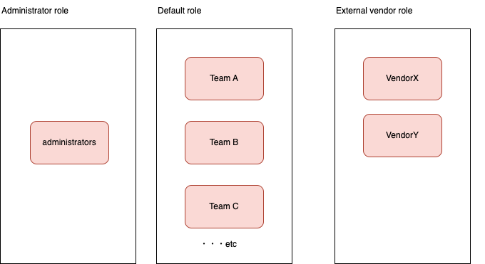

# ポリシー定義ユースケース１

ここでは次のようなポリシー定義をすることを想定します。

## ロール

###  管理者ロール

Backstageのすべての操作権限を持つユーザーロールとします。
ここでは `administrators` グループに属するユーザーの場合を管理者とし、権限を許可します。

### 外部ベンダーロール

特定の操作のみ許可するロールとします。
例えば組織外の外部ベンダーユーザーなどの場合の想定です。

このユースケースでは`Vendor X` グループを外部ベンダーユーザーとし、以下の権限を許可します。

- catalogデータの場合、`Team A` に属するcatalogの参照権限を許可します。作成・削除は許可しません。
- scaffolderの操作は許可しません。
- その他未知の操作があった場合も許可しません。

また特殊な例として `Vendor Y` を設定しています。この例では以下の権限を許可します。

- catalogデータの場合、catalogの作成権限および`Team B` に属するcatalogの参照権限を許可します。削除は許可しません。
- scaffolderの操作を許可します。
- その他未知の操作があった場合も許可しません。

### デフォルトロール

特に指定のない場合の一般ユーザーロールとします。

このユースケースでは以下のように定義します。

- 全データの参照および作成を許可
- catalogデータの場合、データのオーナー（またはオーナーグループに属する）ユーザーの場合は削除を許可する
- scaffolderのすべての操作を許可する
